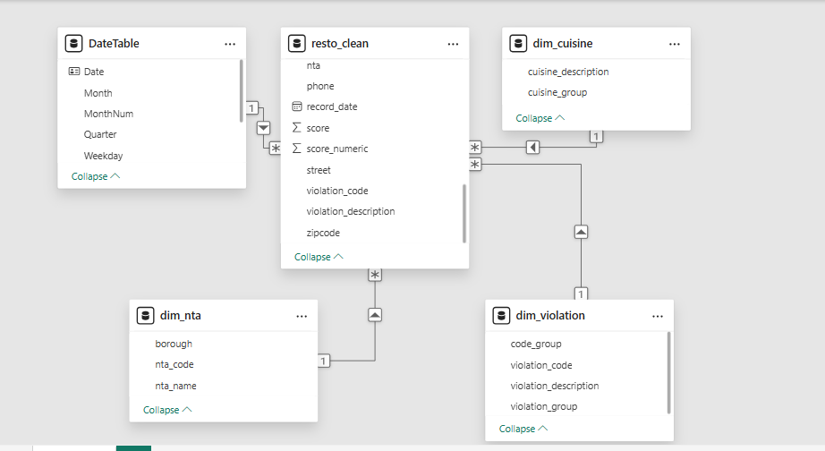
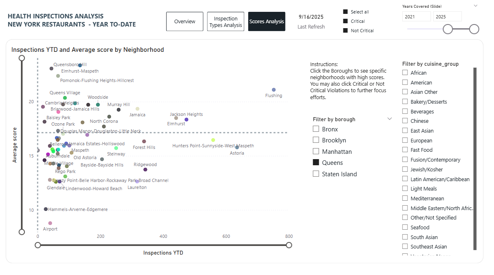
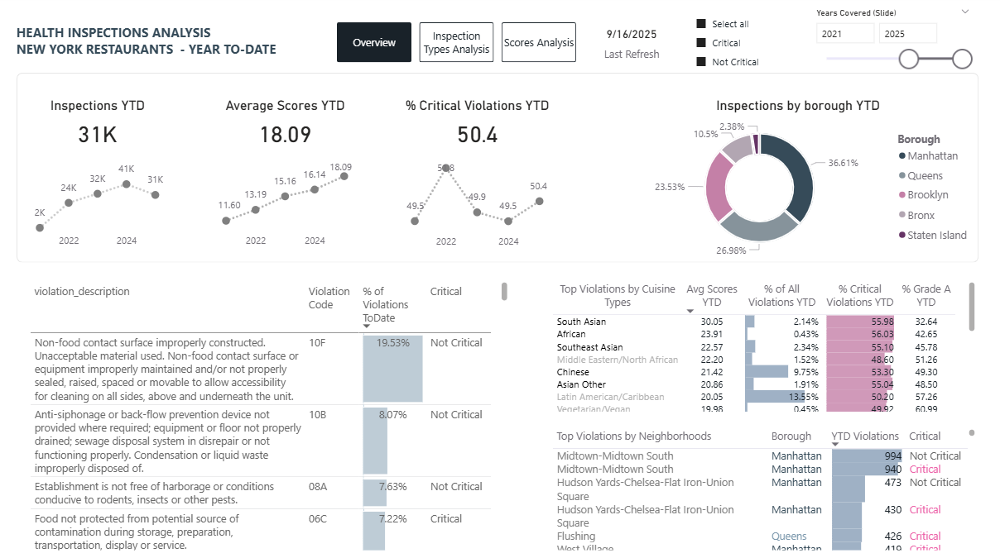
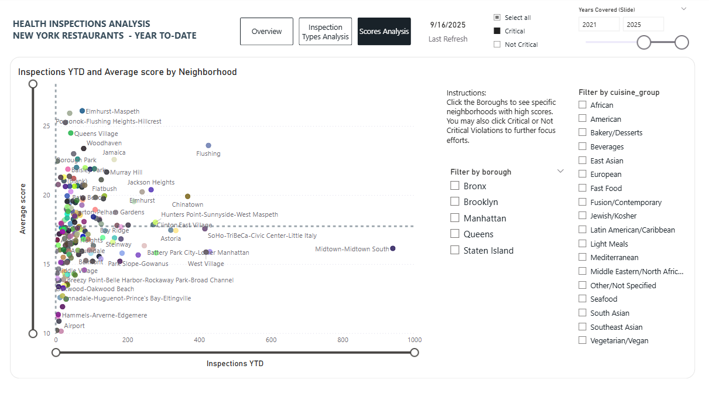

##### Health-Code-Compliance-Analysis-for-NYC-Restaurants

# Title: Restaurant Health Inspection Analysis - NYC With Automated ELT for Data Pipeline

# Difficulty: Advanced

- [Power BI Dashboard Analysis](power-bi-dashboard-analysis)

- [Preliminary SQL Analysis of Restaurant Inspections](preliminary-sql-analysis-of-restaurant-inspections)

- [Automated Data Prep for Power BI Using Python](python/resto_auto_analysis.ipynb)

# Description of Work Done: 
##### SQL: Data cleaning (removal of nulls), standardization, data exploration, additional research to map nta codes to neighborhoods, creation of dimension tables for standardization, preliminary analysis. 
#### Power BI: Data exported from sql pulled into Power BI, fact table resto and dim tables dim_cuisine, dim_violation and violation groups, and dim_nta for actual neighborhood names.
#### Python: Automated ELT Extraction to call API, and load csv file to designated input_file folder, and then transform for Power BI importation.

# Resources: 
#### Software: pgAdmin for postgres SQL, Power BI for report, python in VSCode for the next extract -> load -> transform after downloading updated csv file.

#### [Original csv data set downloaded from this link on 2025-09-19](https://data.cityofnewyork.us/Health/DOHMH-New-York-City-Restaurant-Inspection-Results/43nn-pn8j/about_data)

#### [Neighborhood names in NYC](https://data.cityofnewyork.us/City-Government/2010-Census-Tract-to-Neighborhood-Tabulation-Area-/8ius-dhrr/data_preview)

#### [API Endpoint for Extraction with Python](https://data.cityofnewyork.us/resource/43nn-pn8j.json)

# Workflow:
## For this project: 
#### SQL Transformations -> SQL Initial Analysis -> Csv files to directory -> Csv files imported to Power BI for Analysis -> Power BI relationship defined

## Tested data pipeline: Extract from API and load using python -> Transform using automated python data pipeline notebook  -> Load exported csv file to directory -> Refresh Power BI
[Click here for the Python ELT script that automates extraction and loading](python/resto_auto_extraction_load.ipynb)

# Power BI Dashboard Analysis

## Objective
Provide a clear picture of New York restaurant health inspection patterns to-date, focusing on top violation types, top violations by neighborhoods, top cuisines with percent critical violations,  grade A trends, inspection type distributions, deeper investigations of boroughs and neighborhood scores.

## Overview
- The data set contains about 31K records year-to-date.
- Inspection volume in the public dataset rises sharply after 2020.  Prior years may be incomplete.
- Average scores YTD are around 18 and are trending up. (Higher = worse)
- Critical violations steadily make up roughly half of all violations in the past few years (highest in 2022).   
- Top 10 most frequent violations are on non-food contact surfaces, drainage and liquid waste conditions, conducive to rodents/ insects/ pests, storage/prep/transportation/display protection from contamination, food contact surfaces hygiene, critical temperature controls, mice evidence, flies, not vermin-proof, improper dishwashing.
- Manhattan leads in inspection activity. Queens and Brooklyn follow. This could be due to Manhattan being a hub for tourists.  
- Grade A performance has declined every year since its 2021 peak, consistent with the trend in scores.
- Top 5 cuisines with the lowest average scores (good) are other/unspecified, bakery/desserts, light meals, beverages and fast food. Their very specialized niche menu might contribute to decreased risk of violations.
- Cuisines such as African and South Asian show higher percent critical violations, and the lowest percent Grade A scores. Top 5 cuisines with highest numeric scores are South Asian, African, Southeast Asian, Middle Eastern/North African and Chinese. However, the top 4 only account for about 6% of total violations. 

## Inspection Types Analysis and Scores/ Percent Grade A by Borough
- Inspections are driven by Cycle Inspection Types, both Initial and Re-inspection.  However, Re-inspection counts are much higher than Initial todate. This could indicate a stronger drive to enforce standards, or establishments having more difficulty meeting standards.
- Though Queens is second to Manhattan in count of inspections, it scores worse than Manhattan (higher score = worse). 
- This is supported by the drop in Grade A scores, which is the worst for Queens (Percent Grade A: borough slicer = Queens).

#### This leads to a deep-dive into Queens
- Deep-dive scatterplot - borough slicer set to Queens - shows that Queensborough Hill, Elmhurst-Maspeth, Pomonok-Flushing, Flushing, Queens Village need focused attention with scores way above average.

## Suggested Actions
- Education programs should focus on Food Protection/ Cleanliness/ HACCP, Contamination/ Hygiene/ Vermin, and Temperature Control (TCS).
- Monitor neighborhoods with persistent critical patterns and cuisines with higher percent critical violations for priority outreach or compliance programs.  
- Track the continued rise in re-inspections as a signal that operators may need clearer guidance, or better tools and systems.  Use this trend to refine communication, training materials, and resources to make them more inspection-ready.  

# Preliminary SQL Analysis of Restaurant Inspections
[Click here for the SQL script showing the preliminary analysis and results](https://github.com/SandyGCabanes/Health-Code-Compliance-Analysis-for-NYC-Restaurants/tree/main/sql)
## Summary 

1. Cuisines are just a sub-plot of the entire story
- Some cuisine groups show high average scores and high critical rates, but they make up a tiny share of total inspections. 
- Chasing them won’t move citywide outcomes.

2. Neighborhood patterns point to Queens 
- Queens repeatedly appears in the highest score neighborhoods. 
- These hotspots are neighborhood-specific, not cuisine-driven. The issues cluster geographically, not culturally.

3. Borough performance is mixed
- Queens has the highest average scores and one of the highest critical violation proportions. 
- Manhattan carries the inspection volume but not the best performance. 
- Staten Island swings wildly year to year due to low sample sizes.

4. Violation types tell the clearest story
- Facility Maintenance, Lighting, Dishwashing, and Thermometers dominate the violation counts. 
- These are basic operational failures, not exotic food-handling issues. 
- Fixing these alone would meaningfully reduce total violations.

5. Time trends also tell a story
- Inspection volume jumps up starting 2022.  
- Average scores are rising (worsening).  
- Percent Grade A is falling across every borough.  
- This is not a local problem. It’s a citywide downward trend.

6. What this all means
- The system isn’t failing because of specific cuisines or a few bad neighborhoods.  
- It’s fundamentals: cleanliness, maintenance, temperature control, and basic food safety.  
- The decline in Grade A rates shows the city needs a broad reset, not targeted tweaks.

## Suggested Actions
- Create programs for the 3 highest violation counts -  Facility Maintenance/Equipment issues, Food Protection and Contamination/Hygiene/Vermin.
- Target geographic clusters in Queens neighborhoods if there is a focused outreach program.
- Address worsening score trends through expanded education and compliance support.
- Track cuisine categories (East Asian, Latin American, European, American) with highest volume of above-average scores.  Addressing these would make a bigger dent on overall scores rather than the niche categories.
- Understand root causes of higher critical violations among the niche cuisine categories if resources allow. (African, South Asian, Southeast Asian, Fusion/ Contemporary). Evaluate if quick wins can be achieved with minimal solutions.

[Click here for all the Postgres scripts](sql)

[Click here for the SQL Workflow](sql/sql_workflow.txt)

